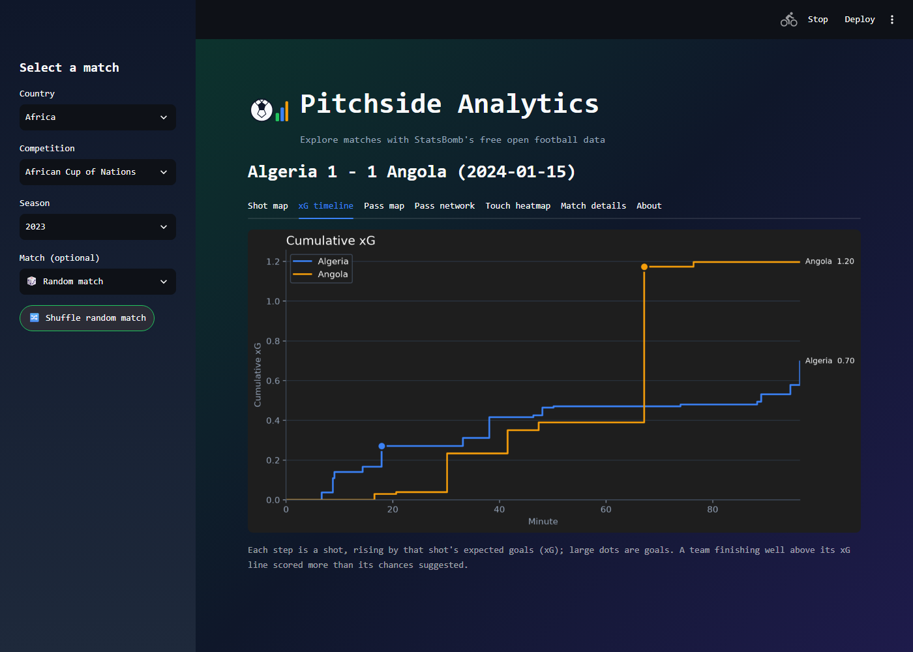
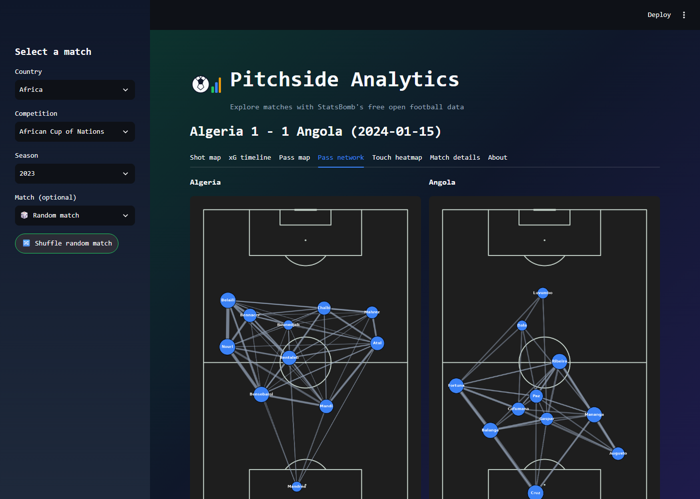
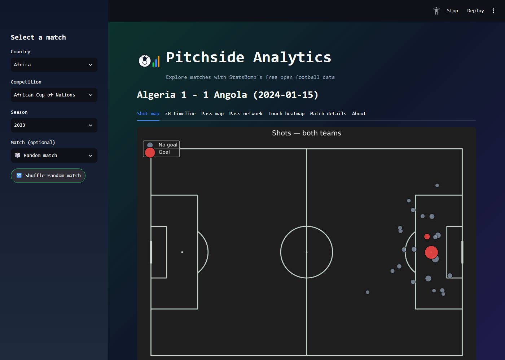

# Pitchside Analytics

[](https://github.com/natraj-kavirayani/pitchside-analytics/actions/workflows/tests.yml)

A Streamlit app for exploring football matches through StatsBomb's free
open event data: shot maps, an xG timeline, pass maps, pass networks,
touch heatmaps, and match details (starting XIs, managers, substitutions).
Built with `statsbombpy` for data access and `mplsoccer` for pitch plotting.



| Pass network | Shot map |
| --- | --- |
|  |  |

## What it shows

- **xG timeline**: each team's cumulative expected goals, shot by shot,
  with goals marked. It shows at a glance whether a result was deserved.
  In the Algeria 1-1 Angola match above, Angola's single big chance
  (0.8 xG) outweighed all of Algeria's shots combined.
- **Pass network**: each player at their average on-the-ball position,
  sized by passes made, linked to the teammates they combined with most.
  Only passes before the team's first substitution are used, so the
  shape reflects one settled XI.
- **Shot map, pass map, touch heatmap**: where the shots, passes and
  touches happened.
- **Match details**: starting XIs with positions, managers and a
  substitution timeline.

## Run it locally

```bash
pip install -r requirements.txt
streamlit run app.py
```

In the sidebar, pick a Country, Competition and Season, then either choose
a match or leave it on "Random match" and use Shuffle. Only the
competitions in StatsBomb's open data are available (e.g. several World
Cups, AFCON 2023, FA WSL, Messi's La Liga seasons).

## Project layout

| File | Purpose |
| --- | --- |
| `data_loader.py` | Wraps `statsbombpy` (`competitions`, `matches`, `events`, `lineups`) with `lru_cache`, plus helpers that turn raw events into shots, passes, substitutions, pass-network data and the xG timeline. |
| `visualizations.py` | Plotting functions that take a DataFrame and return a `matplotlib` Figure. No Streamlit dependency, so they also work in scripts and notebooks. |
| `styling.py` | The visual theme: logo, gradient background, colour-coded tabs, custom font. |
| `app.py` | Streamlit UI: sidebar selectors and one render function per tab. |
| `.streamlit/config.toml` | Forces Streamlit's dark theme to match the custom background. |

## Testing

The test strategy (what can go wrong, why each layer exists, what is
deliberately not tested, and how AI was used) is in [TESTING.md](TESTING.md).

```bash
pip install -r requirements.lock
pytest                    # unit + component tests (mocked data, no network)
pytest --cov              # same, with coverage for data_loader, visualizations, styling
pytest -m e2e             # browser tests; needs `streamlit run app.py` first
```

Before running the e2e tests, run `playwright install chromium` once and
restart any Streamlit server already on port 8501, so the tests check the
current code. Locally they are skipped with a clear reason when no server
is reachable.

GitHub Actions runs on every push and pull request: first the unit and
component tests, then, if those pass, a second job that starts the app,
waits for its health check and runs the e2e tests. In CI a missing server
fails the job instead of skipping, and failed e2e tests upload screenshots,
Playwright traces and the app log as a build artifact.

| Folder | Marker | What it covers |
| --- | --- | --- |
| `tests/unit/` | `unit` | `data_loader.py`, `visualizations.py` and `styling.py`, called directly with mocked StatsBomb responses. |
| `tests/component/` | `component` | The whole app via Streamlit's `AppTest`, with every `data_loader` call mocked. |
| `tests/e2e/` | `e2e` | Playwright tests against a running server on `localhost:8501`: smoke checks of every tab, plus user journeys through a real match (the 2022 World Cup final) on live StatsBomb data. |

Shared mock fixtures (competitions, matches, events, lineups) live in
`tests/conftest.py`. The unit and component tests never reach StatsBomb's
servers; only the e2e user journeys use live data.

## Deploying

The app runs as-is on [Streamlit Community Cloud](https://streamlit.io/cloud):
create an app from this repository with `app.py` as the entry point. The
open data needs no credentials.

## Notes

- `data_loader` caches with `functools.lru_cache`, which suits a single
  user. For a busy multi-user deployment, `st.cache_data` would be the
  better fit.
- The font is Aptos Mono, which only renders for viewers who have it
  installed; everyone else gets a fallback monospace font.
- StatsBomb's open data covers selected competitions only. See their
  [open-data repo](https://github.com/statsbomb/open-data) for the list.
